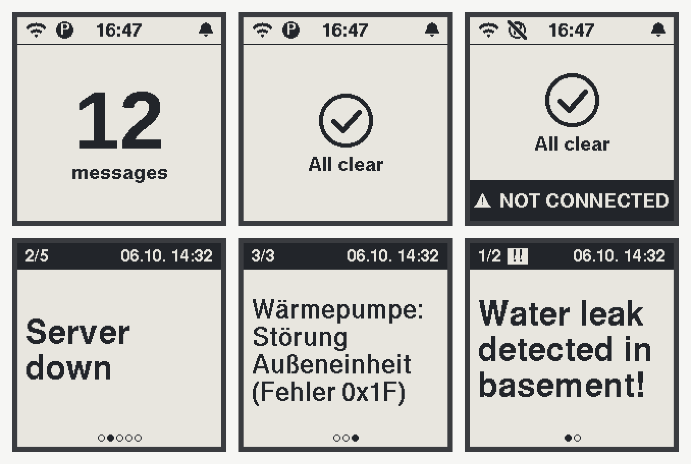
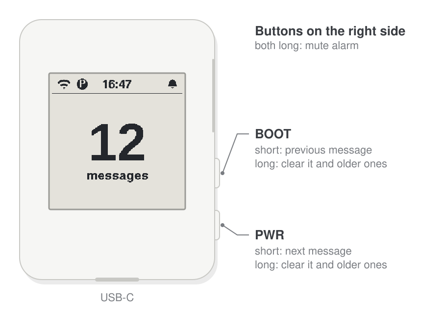

# Pushover_to_esp32

Pushover alert receiver on the Waveshare ESP32-S3-ePaper-1.54. The board
logs in to Pushover as its own device, receives your notifications in real
time, shows high-priority ones on the e-paper display and sounds an alarm
until you acknowledge them with a button.



> **Status:** version 1.0 – in use on the hardware.

## Contents

- [Features](#features)
- [Hardware](#hardware)
- [Display](#display)
- [Buttons](#buttons)
- [Alarm](#alarm)
- [Configuration](#configuration)
  - [WiFi](#wifi)
  - [Pushover device](#pushover-device)
  - [Time zone](#time-zone)
  - [Message expiry](#message-expiry)
- [Building and flashing](#building-and-flashing)
- [Display simulator](#display-simulator)
- [How it works](#how-it-works)
- [License](#license)
- [Credits](#credits)

## Features

- Real-time delivery over Pushover's Open Client WebSocket, no polling
- Messages with priority high (1) and emergency (2) are kept and shown;
  lower priorities are ignored
- Up to 30 messages, kept over power loss (NVS flash)
- Messages not acknowledged within 24 hours expire, so the store doesn't
  fill up with stale alerts after a long time offline
- Loud, deliberately irregular alarm until every message is acknowledged
- Up to three WiFi networks, switched automatically when one fails
- Connection watchdog: reconnects by itself, warns after 15 minutes
  without a connection
- Proportional fonts with German umlauts and other Latin-1 characters

## Hardware

[Waveshare ESP32-S3-ePaper-1.54](https://www.waveshare.com/esp32-s3-epaper-1.54.htm)
(V1 or V2): ESP32-S3 with 8 MB flash and 8 MB PSRAM, 200×200 pixel
black/white e-paper, ES8311 audio codec with speaker, BOOT and PWR
buttons. Power over USB-C. Housing 39.8 × 53 × 16.9 mm. Pin assignment:
`main/user_config.h`.



*Drawing after Waveshare's dimension drawing; the screen is the simulator
output (see [Display simulator](#display-simulator)).*

## Display

**Home screen** – the status bar shows WiFi and Pushover (crossed out
while down), the time (`--:--` until the clock is set via NTP) and the
alarm bell (crossed out while muted). Below it the
number of stored messages, or "All clear". If Pushover cannot be reached
for 15 minutes, a "NOT CONNECTED" banner appears at the bottom.

**Message screen** – a header with the position ("2/5"), `!!` for
emergency priority and the time the message was sent; below it the title,
in the largest font it fits into. Dots at the bottom show the position
among the stored messages. Messages without a title show the name of the
sending application. After 30 seconds without a button press the display
returns to the home screen.

The e-paper uses partial refresh (the clock updates once a minute); once
an hour a full refresh removes ghosting.

## Buttons

| Press | Action |
|---|---|
| BOOT short | previous (older) message |
| PWR short | next (newer) message |
| BOOT or PWR long | acknowledge the message shown **and all older ones** |
| both long | mute / unmute the alarm |

Pushover only knows "everything up to this message has been read", so a
long press always clears the shown message together with all older ones.

## Alarm

While at least one message is stored, the speaker plays series of beeps
with random pitch (1.5–3 kHz), length and pauses – hard to ignore and to
sleep through. It stops when the last message is acknowledged. Muting
(both buttons long) silences it; the bell in the status bar shows the
state.

Independent of that, a quiet short beep every 4 seconds signals that
Pushover has been unreachable for 15 minutes. Mute does not affect it.

## Configuration

All private data lives in `main/secrets.h`, which is listed in
`.gitignore` and never committed. Create it from the template:

```sh
cp main/secrets.h.example main/secrets.h
```

The build stops with a message as long as the file is missing.

### WiFi

Fill in up to three networks (`WIFI_SSID_1` … `WIFI_PASS_3`); leave the
SSID of unused slots empty. On a failure the firmware moves on to the
next network.

### Pushover device

The board is a Pushover [Open Client](https://pushover.net/api/client)
device. It needs a Pushover account with a Desktop/Open Client license
(a one-time purchase per account after a trial period). Register it once
from a computer:

```sh
# 1. log in: returns "secret" (add --form-string "twofa=123456" with 2FA)
curl -s --form-string "email=YOU@EXAMPLE.ORG" --form-string "password=..." \
     https://api.pushover.net/1/users/login.json

# 2. register the device: returns "id"
curl -s --form-string "secret=SECRET" --form-string "name=pushover-esp32" \
     --form-string "os=O" https://api.pushover.net/1/devices.json
```

Put the two values into `PUSHOVER_SECRET` and `PUSHOVER_DEVICE_ID`. The
device then appears in your Pushover account as `pushover-esp32` and can
be targeted on its own.

### Time zone

The clock and message times are shown in local time, set by the POSIX
TZ string `LOCAL_TIMEZONE` in `main/user_config.h` (default: Central
Europe / Berlin with daylight saving time).

### Message expiry

A message that has not been acknowledged `MESSAGE_EXPIRY_HOURS` (default
24) after it was sent expires: it disappears from the display and is
acknowledged on Pushover. Set it to 0 in `main/user_config.h` to keep
messages until you acknowledge them.

The current time comes from NTP (`NTP_SERVER`, default `pool.ntp.org`).
Message dates and the NTP clock are both Unix time (UTC), so the time
zone plays no part in this; it only changes how times are shown. Until
the clock has been set after a restart, nothing expires.

Because Pushover acknowledges "everything up to a message", expiry, like
a long press, always removes the oldest messages first.

## Building and flashing

ESP-IDF v5.5:

```sh
. ~/esp/esp-idf/export.sh
idf.py set-target esp32s3
idf.py build flash monitor
```

Connect the board's USB-C socket (native USB, no bridge chip). If it does
not enter the download mode by itself, hold BOOT while plugging it in.

Release builds (GitHub releases) contain placeholder credentials only;
build your own image with your `main/secrets.h`.

## Display simulator

The screens are drawn by plain C++ (`main/ui.cpp`, `main/render.cpp`)
into a framebuffer, so the same code runs on the PC:

```sh
make -C test/sim
```

This renders every scenario in `test/sim/sim.cpp` to
`test/sim/build/*.png` (3× enlarged, e-paper colours) and refreshes the
overview `docs/img/screens.png` and the board drawing
`docs/img/board.svg`. Needs g++ and Python 3, nothing else.

Fonts are generated from the BDF files in `fonts/` by
`tools/fontgen.py`; see [fonts/README.md](fonts/README.md).

## How it works

1. A WebSocket to `wss://client.pushover.net/push` logs in with the
   device ID and secret. Pushover sends `!` when new messages are waiting,
   `#` as keepalive, `R` to ask for a reconnect and `E` for a permanent
   error (wrong credentials).
2. On `!` the firmware fetches `messages.json` and keeps messages with
   priority ≥ 1 that have not expired. Lower-priority and expired
   messages older than the first kept one are acknowledged right away,
   so Pushover's backlog does not grow.
3. A long press acknowledges up to the shown message
   (`update_highest_message.json`) and fetches again.
4. A watchdog checks WiFi and WebSocket every 2 seconds, restarts the
   connection, tries the next WiFi network, and raises the warning after
   15 minutes. Once a minute it also drops expired messages.

Source overview: `main/pushover_client.cpp` (protocol, message store),
`wifi_connect.cpp`, `display.cpp` (refresh) with `ui.cpp` (screens) and
`ssd1681.cpp` (e-paper controller), `buzzer.cpp` / `audio.cpp` (alarm), `buttons.cpp` /
`button_input.cpp` (gestures).

## License

Beerware, see [LICENSE](LICENSE). Third-party parts keep their licenses,
see below.

## Credits

- `components/codec_board` (ES8311 codec set-up): Espressif Systems,
  ESPRESSIF MIT License
- Pin assignment and outline dimensions: Waveshare's documentation of the
  ESP32-S3-ePaper-1.54; the e-paper driver (`main/ssd1681.cpp`) is written
  after the SSD1681 datasheet and uses the controller's built-in waveforms
- Fonts: Adobe Helvetica (X11) and Liberation Sans, see
  [fonts/README.md](fonts/README.md)

Developed with the help of Claude Code.
